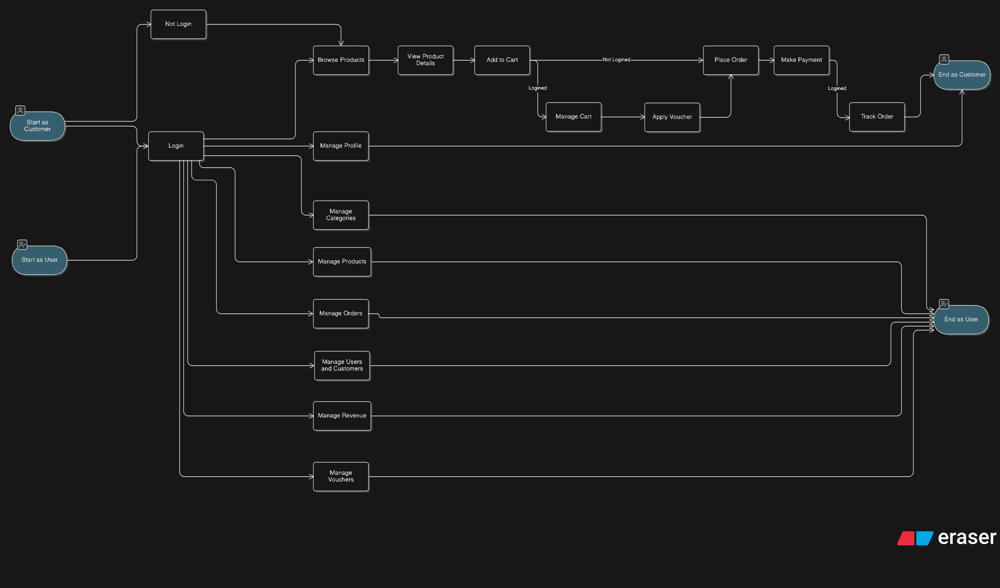

# Milk Tea's E-commerce System Flow Overview

A high-level overview of end-to-end flows for customers and admin users in an e‑commerce system, clarifying process paths and authentication requirements for cross‑team alignment.

## Flow Chart Diagram

## Purpose
This document explains the end‑to‑end flow for both customers and admin users in the e‑commerce system, using standard flow chart conventions for consistent analysis and communication.

## Scope
- Covers customer shopping, checkout, and post‑purchase tracking.
- Covers administrative operations for catalog, orders, users/customers, revenue, and vouchers.
- Excludes detailed warehouse, logistics, and third‑party integrations.

## Roles
- Customer: Can browse as guest or authenticated; authentication is required for personal and transactional actions.
- Admin User: After login, can manage categories, products, orders, users/customers, revenue, and vouchers.

## Flow Summary
- Guest users may browse and view product details.
- Authentication is required for cart management, ordering, payment, tracking, and all admin actions.
- Admin tasks are independent branches initiated after login.

## Customer Flow (Authenticated)
1. Start as Customer.
2. Login.
3. Manage Profile.
4. Browse Products.
5. View Product Details.
6. Add to Cart.
7. Manage Cart.
8. Apply Voucher.
9. Place Order.
10. Make Payment.
11. Track Order.
12. End as Customer.

## Customer Flow (Guest)
1. Start as Customer.
2. Not Login.
3. Browse Products.
4. View Product Details.
5. Add to Cart (ordering requires login).
6. Prompt for Login before Order.

## Admin Flow
1. Start as User.
2. Login.
3. Manage Categories.
4. Manage Products.
5. Manage Orders.
6. Manage Users/Customers.
7. Manage Revenue.
8. Manage Vouchers.
9. End as User.

## Authentication Rules
- Actions requiring authentication are clearly separated from guest‑allowed actions.
- Ordering, payment, tracking, and all admin functions require an authenticated session.
- Browsing and product detail viewing are available to guests.

## Grouping and Layout
- Customer and admin actions are grouped logically for readability.
- Flows should be presented left‑to‑right to minimize visual complexity.

## Assumptions
- A valid session token represents an authenticated state.
- Voucher application occurs after items are in the cart and before payment.
- Tracking is available post‑payment via an order identifier.

## References
- This diagram was made with the useful support by **eraser.io**

