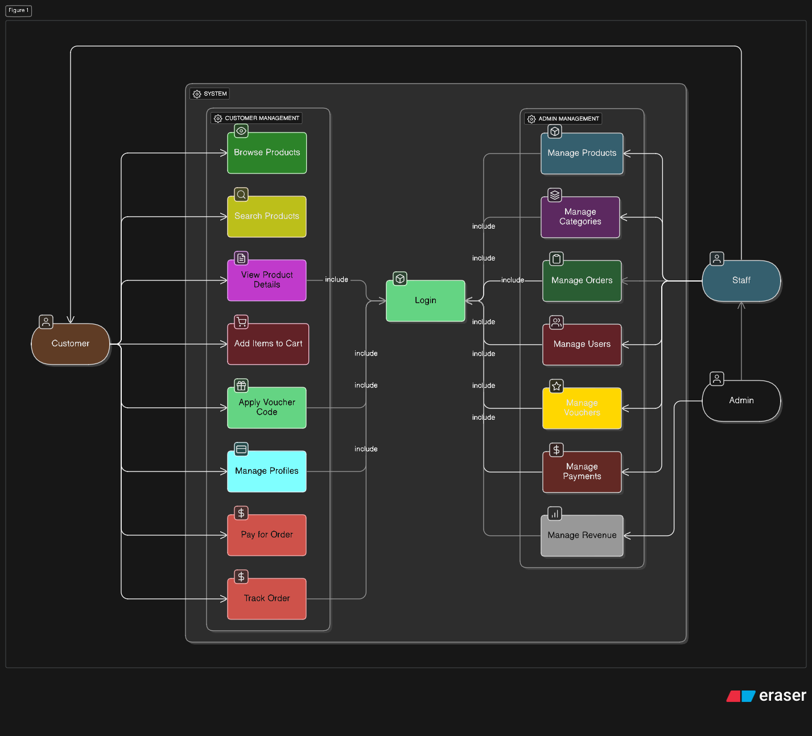

# Milk Tea's E-Commerce System Use Case Documentation

## System Use Case Diagram

---

## Overview

This e-commerce system includes functionalities for Customers, Staff, and Admins. The diagram illustrates the main usage flows and key functions for each user group.

---

## Actors

- **Customer**: Online shopper
- **Staff**: System operation personnel who support management tasks
- **Admin**: Administrator responsible for overall system management

---

## Main Use Cases for Customer

| Function             | Description                                                         |
|----------------------|---------------------------------------------------------------------|
| Browse Products      | Customers view product listings                                     |
| Search Products      | Customers search products by keywords or categories                 |
| View Product Details | View detailed product information including images, prices, etc.    |
| Add Items to Cart    | Add products to the shopping cart                                   |
| Apply Voucher Code   | Apply discount codes to the order                                   |
| Manage Profiles      | Edit personal information, shipping addresses, and purchase history |
| Pay for Order        | Complete payment with supported methods                             |
| Track Order          | Track shipment status and delivery progress                         |

---

## Main Use Cases for Admin

| Function            | Description                                       |
|---------------------|---------------------------------------------------|
| Manage Products     | CRUD products                                     |
| Manage Categories   | CRUD categories                                   |
| Manage Orders       | CRUD order statuses                               |
| Manage Users        | CRUD customer, staff and admin accounts and roles |
| Manage Vouchers     | CRUD promotional codes                            |
| Manage Payments     | Manage payment information and status             |
| Manage Revenue      | View and generate system revenue reports          |

---

## Main Use Cases for Staff

| Function            | Description                                         |
|---------------------|-----------------------------------------------------|
| Manage Products     | View products                                       |
| Manage Categories   | View categories                                     |
| Manage Orders       | View order statuses                                 |
| Manage Users        | View, create and update customer accounts and roles |
| Manage Vouchers     | View promotional codes                              |
| Manage Payments     | View payment information and status                 |

---

## Login Process

- All users (Staffs, Admins) must log in to access their respective functionalities. Role-based authorization redirects users to appropriate features.
- Customers can log in to achieve the interests in managing profile, applying voucher and tracking order.

---

## Use Case Relations

- Customers operate within the “Customer Management” module, performing browsing, searching, purchasing, and profile management.
- Staff and Admin work on the “Admin Management” module, handling data, orders, users, promotions, payments, and reporting.
- All functions are contained in a single SYSTEM framework to ensure synchronized data and unified system operation across roles.

---

## References

- This diagram was made with the useful support by **eraser.io**

