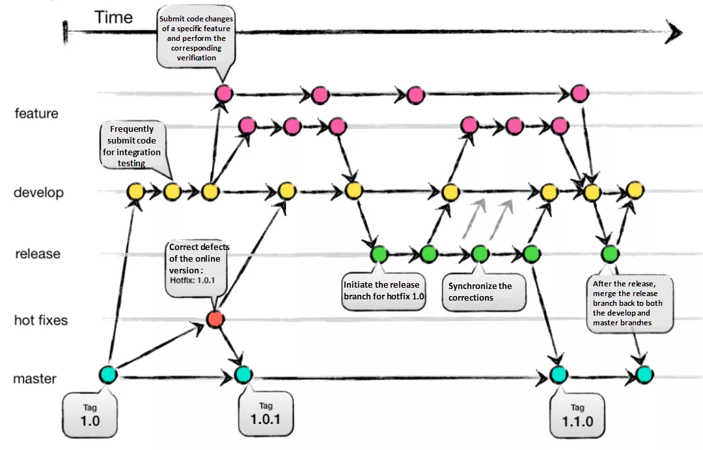

/# GitFlow Workflow - Professional Guide for Team Use

---

## Overview

##### GitFlow is a popular Git branching model that organizes development, testing, and release workflows clearly, allowing safe parallel development and release management by separating branches by purpose.


---


## Branch Definitions

| Branch        | Purpose                                                    | Notes                                  |
|---------------|------------------------------------------------------------|----------------------------------------|
| `main/master` | Stable, production-ready branch                            | Tagged for releases                    |
| `develop`     | Integration branch for ongoing feature development        |                                      |
| `feature/`    | Feature branches off `develop` for independent work       | Named as `feature/ISSUEID-description`|
| `release/`    | Branches from `develop` for final testing and prep        | Release candidate prep                 |
| `hotfix/`     | Urgent fixes from `main` for production issues            | Quick patches                         |

---

## Required Personal Git Configuration
```bash
git config --global pull.rebase true
git config --global rebase.autoStash true
git config --global branch.autoSetupRebase always
```

> **Note:** This is a personal config, all developers should set this to ensure a clean, linear commit history.

---

## Detailed Workflow Steps

### 1. Sync local `develop` branch
```bash
git checkout develop
git pull origin develop # Rebase pull latest changes
```

---

### 2. Create and push feature branch
```bash
git checkout -b feature/123-login develop
git push -u origin feature/123-login
```

---

### 3. Develop and commit code
```bash
git add .
git commit -m "feat(login): validate form (#123)"
```

---

### 4. Rebase feature branch with latest `develop` and push
```bash
git pull origin develop
git push --force-with-lease
```

---

### 5. Create Pull Request (PR) to `develop`

- Title: `feat: login (#123)`
- Description: feature details, testing instructions, link "Fixes #123"
- Wait for code review & CI passing

---

### 6. Fix code per review feedback
```bash
git add .
git commit -m "fix(login): address review comments (#123)"
git pull origin develop
git push --force-with-lease
```

---

### 7. Merge PR into develop

- Use **no-fast-forward** merge to preserve history context
- Or **squash merge** to keep history clean

---

### 8. Clean up feature branch
```bash
git checkout develop
git push origin --delete feature/123-login
git branch -d feature/123-login
git pull origin develop
git fetch -p
```

---

## Release Process
```bash
git checkout -b release/1.2.0 develop

Finalize version, changelog, last fixes
git checkout main
git merge --no-ff release/1.2.0
git tag -a v1.2.0 -m "Release 1.2.0"
git push origin main --tags

git checkout develop
git merge --no-ff release/1.2.0
git branch -d release/1.2.0
git push origin :release/1.2.0
```

---

## Hotfix Process

```bash
git checkout -b hotfix/1.2.1 main

Fix critical bugs, test
git checkout main
git merge --no-ff hotfix/1.2.1
git tag -a v1.2.1 -m "Hotfix 1.2.1"
git push origin main --tags

git checkout develop
git merge --no-ff hotfix/1.2.1
git branch -d hotfix/1.2.1
git push origin :hotfix/1.2.1
```

---

## Branch Naming Conventions

- feature/ISSUEID-description (e.g., feature/123-login)
- bugfix/ISSUEID-description (e.g., bugfix/456-fix-ui)
- release/x.y.z (e.g., release/1.2.0)
- hotfix/x.y.z (e.g., hotfix/1.2.1)

---

## Commit Message Format (Conventional Commits)

feat(scope): short description (#issue)
fix(scope): short description (#issue)
docs(scope): documentation change
chore: maintenance task


**Example:**  
`git commit -m "feat(api): add validation (#789)"`

---

## Best Practices

- Always rebase feature branch on latest develop before pushing.
- Use `git push --force-with-lease` after rebasing for safe force push.
- Protect main and develop branches with branch protection rules requiring PR review and passing CI.
- Clean up remote and local branches after merging.
- Automate builds and tests with CI/CD pipelines triggered on PRs.
- Ensure all devs apply the Git config guidelines for consistent workflow.

---

*End of GitFlow Workflow Documentation*